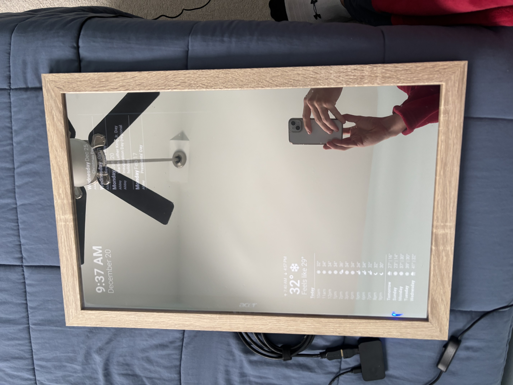

# Pi-Mirror Project

Instructions and lessons for building a smart mirror with a raspberry pi

## Preface

My goal was to make this project possible for anyone to complete, no matter your current computer science knowledge or skillset. I researched and came up with these steps on my own. In the end, this project only cost me $64.

## Materials

### Items I Purchased

* [Raspberry Pi Zero 2 W Starter Kit](https://www.amazon.com/Vilros-Raspberry-Starter-Power-Premium/dp/B0748MPQT4?crid=NDRZIEZEJZJN&dib=eyJ2IjoiMSJ9.qtfm72kkkAtV678HjIkOn3PTV0wH7qqjJ-YZ25GcrZYPk1oYek7ygkdpQwRNYddofAlCVqCJKM8x6Dmupt3K7CKRAB23qjolcTVa3FAJ0Whq4Su7mFfvOIZo9dTqM2DBh8fStUf8u1U97E8baIb05bW5zq0zxOl96FWzzS3hCGqBdqPUO8TgEi9ekbdEC9NmejQ4k92Nl0pRZDu2srsjkCeMhYdluiP_lPfFbxfzoQU.FdqqJGNNs2Qum55nnuickztegiWMEOUzrBgYJrIDOmI&dib_tag=se&keywords=raspberry%2Bpi%2Bpico%2Bzero%2B2%2Bw%2Bkit&qid=1737988599&sprefix=raspberry%2Bpi%2Bpico%2Bzero%2B2%2Bw%2Bkit%2Caps%2C109&sr=8-8&th=1)
* [Picture Frame](https://www.amazon.com/MCS-Black-Studio-Gallery-Woodgrain/dp/B08PHF7187?crid=2TB6CAUVS5EHH&dib=eyJ2IjoiMSJ9._VWESJczStpmntHhXO7pH0uRorzoNPuFmFhEr0-IotDCYGtEBOYykZtBn7ZBweP9xRVzLaw2cPu_i8JSe2Aw2m7htw3xdGvWAofnokvNVnw8B5u73ue5Z74vwv_pF_xRB5qXk8V1It8Zrs5eRlAGKA3KlTU4-Eke7ufdx1hLXVoBSqzTUXatZnjQIslEeUhA-5cK3ig_SgU3jY67gm-l1o8jyKUBBGyH9yveVk5wg7dl7hP3F45kaZ0_OnzdKOAA9TWDiJIunGeUFykRPRQUipNRxsZ41L4EScJDIkuCvxBtEKq80G7wzAjfLXOCZyiVlxpnPzhIesNv9eY_h3tVA2fmF_mgzwQiHRTkguaWH_9I2yYz89Uz-x5gympg2RSY6rHSkVWlZztE_hUeosVS7UAjxovXVWWGgrAN8OpEKsN5FWBviODABuE9XcmRA6dI.4WzD18QMD72WDIgDDXJf_u0ut9F2eeioitsr16bTB2s&dib_tag=se&keywords=14x22%2Bframe&qid=1734387723&sprefix=14x22%2Bframe%2Caps%2C113&sr=8-5&th=1)
* [Mirror Film](https://www.amazon.com/Niviy-Reflective-Adhesive-Daytime-Privacy/dp/B08PKVNVYT?crid=LMAQF79URS9B&dib=eyJ2IjoiMSJ9.4nxwAF_cPK2wOQ8loGEpmSzlIwf3i-3E0Kctja-a84WcSfNBKVG0sf1SfmxhcrFC1qN3pvWuseAfz4A-fSEUm8A8EiXD3-7SAA-iXxaEFeryCq0dgjgk5YpyA448wB1ErfcpD9daEsK0ukuxAT6_6l-vz3PDEbnFHTlQoBNeEy1iIXnQQh7VIvQOIiqI9Ok4LwleFi3efWo_IpOV5fl_c1HSO_RJC3QbN7c6YCRFJMhySBGpl5X3pwtfTczeS1GTvz6T9RrmY6LEBclVr5-E4dqaLTulhHMOrWKyv8YRAm3PWScvNugtgHaunWZhSmu-pwGigv1k52x2kGZ5ef2_EIeBwv7VBFW1s17Z0Gp1hOIL2v2FjstemkqLXcJRngvrGRi-xPfNX0jki7AN_EeetAPQPzP0Ht9JZ-arh8gUXss2jhak-9W9JP8dR69isCrw.b9QKlOnxn8TWX2bAyt9K46jp13YrWswQuO6Ba39hSX4&dib_tag=se&keywords=niviy%2Bone%2Bway%2Bwindow%2Bfilm&qid=1734387893&sprefix=niviy%2Bone%2Bway%2Bwindom%2Bfilm%2Caps%2C89&sr=8-5&th=1)

### Items I Already Had

* Computer Monitor with HDMI Port
* 16GB Micro SD Card
* Micro SD Card Reader
* Scrap Wood
* Wood Saw
* Nails
* Hammer
* Wood Glue
* Wood Clamps
* Metal Wire
* Squeegee
* Double Sided Tape

## Instructions

### Installation Steps

1. Install the [Raspberry Pi Imager](https://www.raspberrypi.com/software/)
2. Download the [Reflect-OS Firmware](https://reflect-os.github.io/) and use the Raspberry Pi Imager to flash the firmware onto your Micro SD Card
3. Follow the [Reflect-OS Quickstart](https://reflect-os.github.io/docs/getting-started/quickstart/) and setup your mirror layout

### Physical Steps

1. Apply the Mirror Film to the Picture Frame (my advice is to have one person lay the film while the other person uses a squeegee and warm water to press it down).
2. Cut 4 pieces of your Scrap Wood using the Wood Saw and use your Hammer to put a Nail halfway into each piece.
3. Put the Computer Monitor on the back of the Picture Frame with Double Sided Tape attaching the bottom and edges.
4. Use Wood Glue and Clamps to secure the Wood Blocks to the back of the Picture Frame (wood glue usually takes 24 hours to dry).
5. Run Metal Wire around the Nails to press and secure the Monitor to the Frame.

## Lessons Learned

* The Reflect-OS solution was chosen for simplicity, but MagicMirror² with SSH access could be an alternative approach for people who want more functionality.
* Having a helper during mirror film application makes the process much easier and reduces air bubbles. I learned this the hard way and had to re-apply the mirror film.
* If I were to do this again, I would have bought wood to build my own frame. It is really challenging to find a picture frame that is sturdy enough to hold a monitor. In the end, my pi-mirror could only be displayed on top of a table.

## Result

